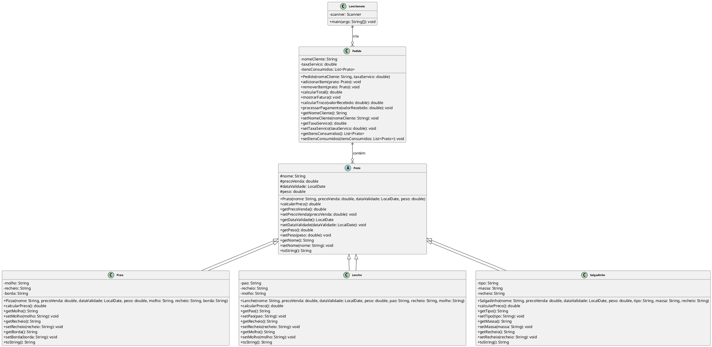

# Diagrama de Classes UML - Sistema de Lanchonete

## Diagrama em PlantUML

## Explicação das Classes

### Classe Lanchonete
- **Responsabilidade**: Classe principal que inicia o sistema e demonstra as funcionalidades
- **Funcionalidade**: Cria instâncias de pratos e pedidos, demonstrando o sistema funcionando

### Classe Pedido
- **Atributos**: nomeCliente, taxaServico, itensConsumidos (lista de Pratos)
- **Funcionalidades**: 
  - Gerenciar itens do pedido (adicionar/remover)
  - Calcular total com taxa de serviço
  - Gerar fatura detalhada
  - Calcular troco
  - Processar pagamento

### Classe Abstrata Prato
- **Atributos**: nome, precoVenda, dataValidade, peso
- **Método Abstrato**: calcularPreco() - implementado diferentemente por cada tipo de prato
- **Funcionalidade**: Classe base que define a estrutura comum para todos os tipos de pratos

### Classe Pizza
- **Atributos Específicos**: molho, recheio, borda
- **Lógica de Preço**: Adiciona custos extras para bordas recheadas e recheios especiais
- **Herança**: Estende Prato

### Classe Lanche
- **Atributos Específicos**: pao, recheio, molho
- **Lógica de Preço**: Adiciona custos extras para pães integrais/artesanais e recheios especiais
- **Herança**: Estende Prato

### Classe Salgadinho
- **Atributos Específicos**: tipo (frito/assado), massa, recheio
- **Lógica de Preço**: Adiciona custos extras para salgadinhos assados e massas especiais
- **Herança**: Estende Prato

## Relacionamentos
- **Lanchonete** cria **Pedido** (relacionamento de criação)
- **Pedido** tem uma relação de composição com **Prato** (0..* itens)
- **Pizza**, **Lanche** e **Salgadinho** herdam de **Prato**
- Uso de **polimorfismo** para tratar todos os tipos de pratos de forma uniforme

## Justificativa das Escolhas de Design

### 1. **Arquitetura em Camadas e Separação de Responsabilidades**
**Escolha:** Separação clara entre entidades de domínio (Prato, Pedido) e a interface do usuário (Lanchonete).

**Justificativa:** Esta separação permite que o sistema seja facilmente expandido para diferentes interfaces (web, desktop, API) sem modificar a lógica de negócio.

### 2. **Uso de Classes Abstratas para Modelagem de Hierarquias**
**Escolha:** `Prato` como classe abstrata com método abstrato `calcularPreco()`.

**Justificativa:** Permite implementar diferentes tipos de prato com comportamentos específicos mantendo a interface comum. Facilita a adição de novos tipos de prato no futuro.

### 3. **Implementação de Polimorfismo para Cálculos de Preço**
**Escolha:** Método abstrato `calcularPreco()` em `Prato`.

**Justificativa:** Permite que cada tipo de prato implemente sua própria lógica de cálculo, facilitando a manutenção e extensão. O sistema pode calcular preços de forma genérica através de referências polimórficas.

### 4. **Composição sobre Herança para Itens do Pedido**
**Escolha:** `Pedido` contém uma lista de `Prato` em vez de herdar deles.

**Justificativa:** Um pedido não "é" um prato, mas "tem" pratos. Esta abordagem permite que um pedido contenha múltiplos tipos de prato simultaneamente, oferecendo maior flexibilidade.

### 5. **Encapsulamento e Validação de Dados**
**Escolha:** Atributos privados com métodos públicos de acesso.

**Justificativa:** Garante a integridade dos dados e previne estados inválidos. Facilita futuras validações nos setters.

### 6. **Uso de Collections Genéricas**
**Escolha:** `List<Prato>` com tipos parametrizados.

**Justificativa:** Proporciona type safety em tempo de compilação, evitando erros de runtime relacionados a tipos incorretos.

### 7. **Design de Interface Consistente**
**Escolha:** Métodos `toString()` implementados em todas as classes para representação textual consistente.

**Justificativa:** Facilita o debugging, logging e a interface com o usuário. Todas as entidades podem ser exibidas de forma padronizada.

## Conclusão

O design do sistema de lanchonete segue os princípios SOLID e padrões de design estabelecidos, criando uma base sólida para um sistema de pedidos escalável e manutenível. A arquitetura escolhida permite que o sistema evolua naturalmente conforme novos requisitos são identificados, mantendo a coesão alta e o acoplamento baixo entre os componentes. 